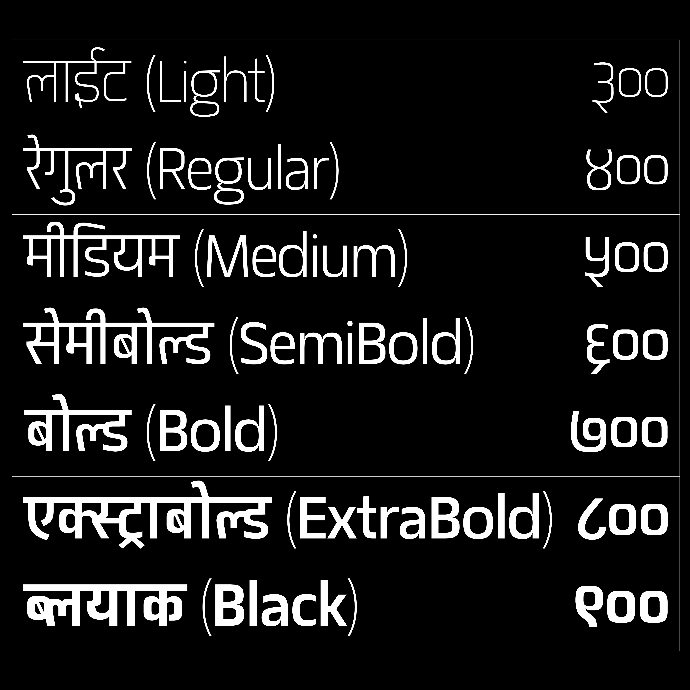

Matangi is a semi-condensed sans-serif variable typeface that supports both Latin and Devanagari scripts. It includes seven static weights — ExtraLight, Light, Regular, Medium, Bold, ExtraBold, and Black — offering a flexible range suitable for titles, headings, logos, and small body text. 
Started as a personal challenge and a love for typography, this project was a journey of exploration and self-learning, designed to offer a flexible, functional tool for multilingual design. It is also the first variable font project from Nepal, with the hope of benefiting users worldwide.

The design is based on simple geometric shapes, primarily squares and circles, giving the letterforms a structured, rational character. Subtle inktraps are applied at stroke joints for aesthetic purposes, ensuring even typographic color across various sizes and weights. 

The x-height of the Latin script and the base character height of the Devanagari script are carefully aligned to create visual harmony when typesetting both scripts together. Matangi includes over 1,600 glyphs and provides extensive language support, covering more than 150 (Devanagari & Latin Based) languages, primarily including Nepali, Sanskrit, Hindi, Marathi, Awadhi, Dotyali and Latin-based languages. It seamlessly renders extended Sanskrit ligatures and complex Devanagari matras.
## License

Matangi is licensed under the [SIL Open Font License v1.1](http://scripts.sil.org/OFL).  
To view the copyright and specific terms and conditions, please refer to the [OFL.txt](./OFL.txt).

## Downloading Font Binaries (TTF Files)

You can find binary releases (TTF files) [here](https://github.com/thegraphicant/Matangi/tree/main/fonts).

## How Do I Install the Font on My Computer?

- [**_Windows_**](https://support.microsoft.com/en-us/office/add-a-font-b7c5f17c-4426-4b53-967f-455339c564c1)
- [**_GNU/Linux_**](https://medium.com/source-words/how-to-manually-install-update-and-uninstall-fonts-on-linux-a8d09a3853b0)
- [**_macOS_**](https://support.apple.com/guide/font-book/install-and-validate-fonts-fntbk1000/mac)

## Bug Reports

Please send bug reports, feature requests, or glyph enhancements using the [GitHub Issue Tracker](https://github.com/thegraphicant/Matangi/issues).
